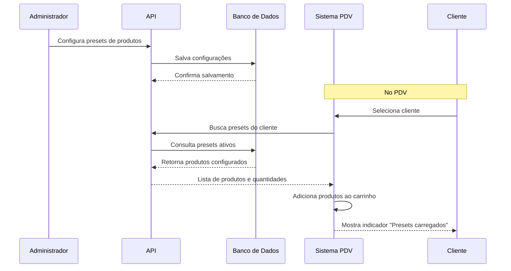

# Presets de Produtos para Clientes

## Visão Geral

A funcionalidade de **Presets de Produtos** permite que os administradores configurem produtos específicos que serão adicionados automaticamente ao carrinho quando um cliente for selecionado no PDV. Isso é especialmente útil para clientes que frequentemente compram os mesmos itens.

## Como Funciona

### 1. Configuração pelo Administrador

- Acesse a página de detalhes de um cliente no painel administrativo
- Na seção "Preset de Produtos", clique em "Adicionar Produto"
- Busque e selecione os produtos desejados
- Defina a quantidade para cada produto
- Salve os presets

### 2. Uso no PDV

- Quando um cliente for selecionado no PDV
- Os produtos configurados no preset são automaticamente adicionados ao carrinho
- Um indicador visual mostra "Produtos do preset carregados"
- As quantidades são somadas se o produto já existir no carrinho

## Funcionalidades

### ✅ Recursos Implementados

- **Gerenciamento de Presets**: Interface intuitiva para configurar produtos e quantidades
- **Busca de Produtos**: Filtro por nome ou código de barras
- **Validação de Estoque**: Produtos com estoque insuficiente não são adicionados
- **Integração com PDV**: Carregamento automático ao selecionar cliente
- **Indicador Visual**: Feedback claro quando presets são carregados
- **Persistência**: Presets são salvos no banco de dados

### 🔧 Configurações Técnicas

- **Tabela**: `CustomerProductPreset`
- **Relacionamentos**: Cliente → Produto (N:N)
- **Campos**: ID, Cliente, Produto, Quantidade, Ativo, Timestamps
- **API**: `/api/customers/[id]/presets`

## Estrutura do Banco de Dados

```sql
-- Nova tabela para presets
CREATE TABLE "CustomerProductPreset" (
  "id" TEXT NOT NULL,
  "customerId" TEXT NOT NULL,
  "productId" TEXT NOT NULL,
  "quantity" INTEGER NOT NULL DEFAULT 1,
  "active" BOOLEAN NOT NULL DEFAULT true,
  "createdAt" TIMESTAMP(3) NOT NULL DEFAULT CURRENT_TIMESTAMP,
  "updatedAt" TIMESTAMP(3) NOT NULL,
  
  CONSTRAINT "CustomerProductPreset_pkey" PRIMARY KEY ("id"),
  CONSTRAINT "CustomerProductPreset_customerId_productId_key" UNIQUE ("customerId", "productId")
);

-- Índices para performance
CREATE INDEX "CustomerProductPreset_customerId_idx" ON "CustomerProductPreset"("customerId");
CREATE INDEX "CustomerProductPreset_productId_idx" ON "CustomerProductPreset"("productId");
```

## Fluxo de Funcionamento



## Casos de Uso

### 🏪 Restaurantes e Lanchonetes
- **Cliente Frequente**: Sempre pede o mesmo prato execututivo
- **Cliente Corporativo**: Pedidos padronizados para reuniões
- **Delivery Regular**: Produtos que sempre são incluídos

### 🛒 Varejo
- **Cliente VIP**: Produtos de preferência
- **Assinatura**: Itens mensais automáticos
- **Pacotes**: Combinações de produtos frequentes

## Vantagens

1. **Agilidade**: Reduz tempo de atendimento
2. **Precisão**: Evita esquecimentos de itens
3. **Personalização**: Experiência customizada por cliente
4. **Eficiência**: Aumenta velocidade do PDV
5. **Satisfação**: Cliente recebe sempre o que costuma pedir

## Limitações e Considerações

### ⚠️ Limitações Atuais
- Produtos com estoque zero não são adicionados
- Não há histórico de presets utilizados
- Quantidades fixas (não variam por dia/hora)

### 🔮 Melhorias Futuras
- **Presets Temporários**: Configurações por dia da semana
- **Presets Condicionais**: Baseados em histórico de compras
- **Notificações**: Alertas quando produtos do preset estão indisponíveis
- **Analytics**: Relatórios de uso dos presets

## Manutenção

### Scripts de Seed
```bash
# Executar seed de presets
npx tsx scripts/seed-customer-presets.ts
```

### Limpeza de Dados
- Presets inativos são marcados como `active: false`
- Não são fisicamente removidos para manter histórico
- API de DELETE marca todos como inativos

## Troubleshooting

### Problemas Comuns

1. **Presets não carregam**
   - Verificar se cliente tem presets ativos
   - Confirmar se produtos estão ativos
   - Verificar logs do console

2. **Produtos não aparecem no carrinho**
   - Verificar estoque dos produtos
   - Confirmar se produtos são do tipo "sellable"
   - Verificar permissões de usuário

3. **Erro ao salvar presets**
   - Verificar se cliente existe
   - Confirmar se produtos são válidos
   - Verificar conexão com banco de dados

### Logs Úteis
```javascript
// No console do navegador
console.log('Presets carregados:', presets);
console.log('Produtos adicionados:', newItems);
```

## Contribuição

Para contribuir com melhorias nesta funcionalidade:

1. Crie uma branch para sua feature
2. Implemente as mudanças
3. Adicione testes se aplicável
4. Atualize a documentação
5. Submeta um Pull Request

---

**Versão**: 1.0.0  
**Data**: Agosto 2025  
**Autor**: Equipe de Desenvolvimento
