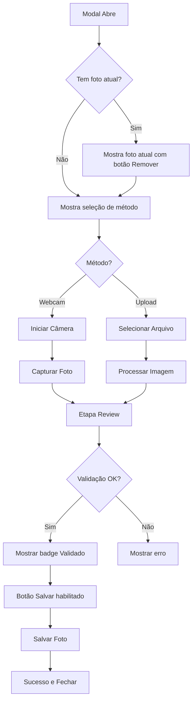

# Plano de Ajuste de Layout - FacialCaptureModal

## Objetivo
Ajustar o layout do `FacialCaptureModal` para ficar visualmente consistente com o `CustomerPhotoModal` utilizado no cadastro de clientes.

---

## Análise Comparativa

### Diferenças Identificadas

| Aspecto | FacialCaptureModal (Atual) | CustomerPhotoModal (Referência) |
|---------|---------------------------|--------------------------------|
| **Estrutura Base** | `<div>` customizada com overlay | Componente `<Dialog>` do shadcn/ui |
| **Largura** | `max-w-3xl` (768px) | `sm:max-w-[600px]` |
| **Header** | Customizado com gradiente azul | `<DialogHeader>` padrão |
| **Ícone Header** | `bg-blue-100` fixo | `var(--modal-header-icon-bg)` dinâmico |
| **Indicador Progresso** | Dots de progresso | Não possui |
| **Padding Conteúdo** | `p-6` | `px-6 py-5 space-y-4` |
| **Footer** | Customizado `bg-slate-50/30` | `<DialogFooter>` padrão |
| **Botões** | `h-11` (maiores) | `h-8 text-xs` (menores) |
| **Textos Botões** | "Capturar Foto", "Salvar Foto" | "Capturar", "Usar esta foto" |
| **Preview** | Imagem grande max-h-96 | Circular h-40 w-40 |
| **Dicas** | Seção de dicas presente | Não possui |

---

## Plano de Implementação

### Etapa 1: Estrutura Base do Modal
**Arquivo:** `app/admin/components/FacialCaptureModal.tsx`

Substituir a estrutura de `<div>` customizada pelo componente `<Dialog>` do shadcn/ui:

```tsx
// ANTES (linhas 447-448)
<div className="fixed inset-0 z-50 bg-black/60 backdrop-blur-sm flex items-center justify-center p-4">
  <div className="w-full max-w-3xl bg-white rounded-2xl shadow-2xl...>

// DEPOIS
<Dialog open={isOpen} onOpenChange={(v) => !v && handleClose()}>
  <DialogContent className="sm:max-w-[600px] max-h-[85vh] flex flex-col overflow-hidden">
```

### Etapa 2: Header do Modal
Substituir o header customizado pelo `<DialogHeader>` padrão:

```tsx
// ANTES (linhas 449-498)
<div className="px-6 py-4 border-b border-slate-100 bg-gradient-to-r from-blue-50 to-indigo-50/50">
  // ... header customizado com indicadores de progresso
</div>

// DEPOIS
<DialogHeader>
  <div className="flex items-center gap-3">
    {step === "review" && (
      <Button variant="ghost" size="icon" onClick={...} className="h-8 w-8 -ml-2">
        <ArrowLeft className="h-4 w-4" />
      </Button>
    )}
    <div className="h-9 w-9 rounded-lg flex items-center justify-center shadow-sm"
         style={{ background: "var(--modal-header-icon-bg)" }}>
      <Camera className="h-5 w-5 text-primary" />
    </div>
    <div>
      <h2 className="text-base font-semibold text-gray-900">
        {step === "capture" ? (currentFacialImageUrl ? "Atualizar Foto Facial" : "Cadastrar Foto Facial") : "Confirmar Foto"}
      </h2>
      <p className="text-xs text-gray-500 mt-0.5">
        {step === "capture" ? "Tire uma foto ou envie um arquivo" : userName}
      </p>
    </div>
  </div>
</DialogHeader>
```

### Etapa 3: Área de Conteúdo
Ajustar padding e espaçamento:

```tsx
// ANTES (linha 501)
<div className="flex-1 overflow-y-auto p-6">

// DEPOIS
<div className="flex-1 overflow-y-auto px-6 py-5 space-y-4">
```

### Etapa 4: Botões da Webcam
Reduzir tamanho dos botões:

```tsx
// ANTES (linhas 628-644, 664-681)
<Button onClick={startWebcam} className="bg-blue-600 hover:bg-blue-700 text-white">
  <Camera className="h-4 w-4 mr-2" />
  Iniciar Câmera
</Button>

<Button onClick={capturePhoto} className="flex-1 bg-blue-600 hover:bg-blue-700 text-white h-11">
  <Camera className="h-4 w-4 mr-2" />
  Capturar Foto
</Button>

// DEPOIS
<Button onClick={startWebcam} variant="default" size="sm" className="text-xs h-8">
  <Camera className="h-3.5 w-3.5 mr-1.5" />
  Iniciar Câmera
</Button>

<Button onClick={capturePhoto} className="flex-1 h-8 text-xs">
  <Camera className="h-3.5 w-3.5 mr-1.5" />
  Capturar
</Button>
```

### Etapa 5: Botões do Upload
Reduzir tamanho e ajustar textos:

```tsx
// ANTES (linhas 706-711)
<p className="text-sm font-medium text-slate-700 group-hover:text-blue-600 transition-colors">
  Clique para selecionar uma imagem
</p>
<p className="text-xs text-slate-500 mt-1">
  PNG, JPG ou JPEG
</p>

// DEPOIS
<p className="text-xs font-medium text-slate-700 group-hover:text-primary transition-colors">
  Clique para selecionar
</p>
<p className="text-[10px] text-slate-500 mt-0.5">
  PNG, JPG ou JPEG
</p>
```

### Etapa 6: Footer do Modal
Substituir footer customizado pelo `<DialogFooter>`:

```tsx
// ANTES (linhas 803-849)
<div className="px-6 py-4 border-t border-slate-100 bg-slate-50/30">
  <div className="flex justify-between items-center gap-3">
    // ... botões customizados
  </div>
</div>

// DEPOIS
<DialogFooter>
  <Button variant="outline" size="sm" onClick={handleClose} className="text-xs h-8">
    Cancelar
  </Button>
  {step === "review" && capturedImage && faceValidated && !success && (
    <Button size="sm" onClick={saveFacialImage} disabled={loading} className="text-xs h-8">
      {loading ? (
        <>
          <Loader2 className="h-3.5 w-3.5 mr-1.5 animate-spin" />
          Salvando...
        </>
      ) : (
        <>
          <CheckCircle2 className="h-3.5 w-3.5 mr-1.5" />
          Salvar Foto
        </>
      )}
    </Button>
  )}
</DialogFooter>
```

### Etapa 7: Preview da Foto (Etapa Review)
Ajustar para formato mais compacto:

```tsx
// ANTES (linhas 734-746)
<div className="relative bg-gradient-to-br from-slate-50 to-slate-100 rounded-xl overflow-hidden border-2 border-slate-200">
  
  // ...
</div>

// DEPOIS - Manter layout maior para validação facial, mas ajustar estilos
<SectionDivider label="Preview da Foto" />
<div className="flex flex-col items-center gap-4">
  <div className="relative bg-gradient-to-br from-slate-50 to-slate-100 rounded-xl overflow-hidden border-2 border-slate-200 max-w-full">
    
    {faceValidated && (
      <div className="absolute top-3 right-3 bg-emerald-500 text-white px-2.5 py-1 rounded-full flex items-center gap-1.5 shadow-lg">
        <CheckCircle2 className="h-3.5 w-3.5" />
        <span className="text-[10px] font-medium">Validado</span>
      </div>
    )}
  </div>
</div>
```

### Etapa 8: Remover Indicadores de Progresso
Remover os dots de progresso do header (linhas 484-487).

### Etapa 9: Ajustar Seção de Dicas
Manter as dicas mas com visual mais compacto:

```tsx
// ANTES (linhas 719-726)
<div className="bg-blue-50/50 border border-blue-100 rounded-xl p-4">
  <p className="text-xs font-semibold text-blue-900 mb-2">💡 Dicas para melhor resultado</p>
  <ul className="text-xs text-blue-800 space-y-1">
    // ...
  </ul>
</div>

// DEPOIS
<div className="bg-blue-50/50 border border-blue-100 rounded-lg p-3">
  <p className="text-[10px] font-semibold text-blue-900 mb-1.5">💡 Dicas</p>
  <ul className="text-[10px] text-blue-800 space-y-0.5">
    // ...
  </ul>
</div>
```

---

## Imports Necessários

Adicionar os imports do componente Dialog:

```tsx
import {
  Dialog,
  DialogContent,
  DialogFooter,
  DialogHeader,
} from "@/app/components/ui/dialog";
```

---

## Observações Importantes

1. **Funcionalidade de Validação Facial**: Manter toda a lógica de validação facial intacta - apenas ajustar o visual.

2. **Remoção de Foto**: O botão de remover foto atual deve ser mantido, mas reposicionado no footer ou na seção de foto atual.

3. **Mensagens de Sucesso/Erro**: Manter os Alert components, apenas ajustar padding se necessário.

4. **DeleteConfirmDialog**: Manter o diálogo de confirmação de remoção como está (fora do Dialog principal).

---

## Diagrama do Fluxo



---

## Checklist de Implementação

- [ ] Substituir estrutura base para Dialog
- [ ] Ajustar header para DialogHeader
- [ ] Remover indicadores de progresso
- [ ] Ajustar padding e espaçamento do conteúdo
- [ ] Reduzir tamanho dos botões
- [ ] Ajustar textos dos botões
- [ ] Ajustar footer para DialogFooter
- [ ] Compactar seção de dicas
- [ ] Testar fluxo completo de captura
- [ ] Testar fluxo de upload
- [ ] Testar validação facial
- [ ] Testar remoção de foto
