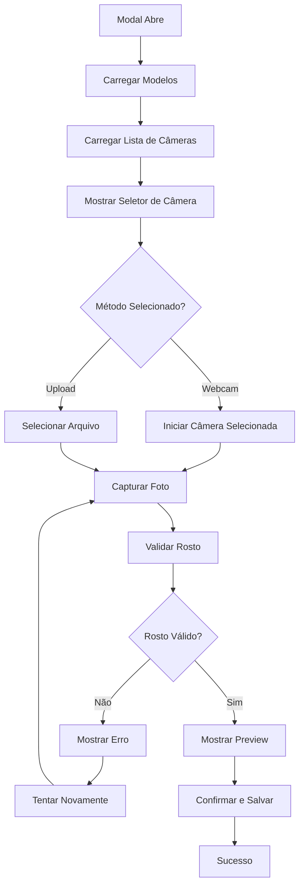

# Plano de Redesign do Modal de Reconhecimento Facial

## Visão Geral
Redesign completo do [`FacialCaptureModal`](app/admin/components/FacialCaptureModal.tsx) para alinhar com o tema do projeto (azul profissional), melhorar a experiência do usuário e adicionar funcionalidade de seleção de câmera.

## Análise do Estado Atual

### Problemas Identificados
1. **Inconsistência de Cores**: Modal usa laranja (orange-500/600) enquanto o tema usa azul (blue-500/600)
2. **Falta de Seleção de Câmera**: Usa apenas a câmera padrão, sem opção de escolher entre múltiplas câmeras
3. **Layout Pode Ser Mais Moderno**: Estrutura funcional mas não tão elegante quanto outros modais do projeto
4. **Feedback Visual Pode Ser Melhorado**: Estados de loading, validação e sucesso podem ser mais claros

### Referências de Design
- [`CustomerPhotoModal.tsx`](app/admin/customers/components/CustomerPhotoModal.tsx) - Excelente exemplo de seleção de câmera
- [`theme.ts`](app/admin/theme.ts) - Paleta de cores azul profissional
- [`globals.css`](app/globals.css) - Design system do projeto
- [`dialog.tsx`](app/components/ui/dialog.tsx) - Componente Dialog padrão do projeto

## Melhorias Planejadas

### 1. Atualização de Cores para Alinhar com o Tema

**Mudanças:**
- Substituir `orange-500/600` por `blue-500/600` (primary colors)
- Usar gradientes azuis consistentes com o tema
- Atualizar ícones e badges para usar a paleta azul
- Manter consistência com variáveis CSS do design system

**Impacto:**
- Cores primárias: `bg-blue-600 hover:bg-blue-700`
- Gradientes: `from-blue-400 to-blue-500`
- Status badges: azul para informações, verde para sucesso, vermelho para erro

### 2. Implementação de Seleção de Câmera

**Funcionalidades:**
- Detectar automaticamente todas as câmeras disponíveis
- Exibir dropdown para selecionar a câmera desejada
- Reiniciar stream quando câmera é alterada
- Mostrar nome da câmera ou "Câmera X" se não tiver label

**Implementação:**
```typescript
// Novos estados
const [videoDevices, setVideoDevices] = useState<MediaDeviceInfo[]>([]);
const [selectedDeviceId, setSelectedDeviceId] = useState<string>("");

// Função para carregar dispositivos
const loadVideoDevices = async () => {
  // Solicitar permissão primeiro
  await navigator.mediaDevices.getUserMedia({ video: true, audio: false });
  
  // Enumerar dispositivos
  const devices = await navigator.mediaDevices.enumerateDevices();
  const videoDevices = devices.filter(device => device.kind === 'videoinput');
  setVideoDevices(videoDevices);
  
  // Selecionar primeira câmera por padrão
  if (videoDevices.length > 0) {
    setSelectedDeviceId(videoDevices[0].deviceId);
  }
};

// Atualizar constraints do getUserMedia
const constraints: MediaStreamConstraints = {
  video: {
    width: { ideal: 640 },
    height: { ideal: 480 },
    facingMode: "user",
    ...(selectedDeviceId && { deviceId: { exact: selectedDeviceId } })
  },
  audio: false,
};
```

**UI Component:**
- Usar componente [`Select`](app/components/ui/select.tsx) do projeto
- Posicionar acima do botão "Iniciar Câmera"
- Mostrar apenas quando houver múltiplas câmeras
- Label: "Câmera" com estilo consistente

### 3. Modernização do Layout

**Header:**
- Usar [`DialogHeader`](app/components/ui/dialog.tsx) padrão do projeto
- Gradiente azul no background: `bg-gradient-to-r from-blue-50 to-indigo-50/50`
- Ícone com background azul: `bg-blue-100`
- Títulos e descrições com cores do tema

**Conteúdo:**
- Espaçamento mais generoso entre seções
- Cards com sombras suaves: `shadow-lg`
- Bordas mais sutis: `border-slate-200`
- Animações suaves de transição

**Seções Organizadas:**
1. Foto Atual (se existir)
2. Seletor de Método (Webcam/Upload)
3. Seletor de Câmera (se múltiplas)
4. Área de Captura/Upload
5. Dicas e Instruções

**Footer:**
- Botões alinhados à direita
- Cores consistentes com o tema
- Estados de loading visíveis

### 4. Melhoria da Experiência do Usuário

**Feedback Visual:**
- Loading states com spinner animado
- Progress indicators para cada etapa
- Mensagens de erro mais claras e acionáveis
- Sucesso com animação de confete ou checkmark animado

**Animações:**
- Transições suaves entre etapas
- Fade in/out para mensagens
- Scale effects para botões
- Pulse effects para elementos importantes

**Acessibilidade:**
- Labels claros para todos os inputs
- Focus states visíveis
- Keyboard navigation suportada
- Screen reader friendly

**Instruções Claras:**
- Dicas visuais para captura de boa qualidade
- Guia de rosto no preview da câmera
- Mensagens de erro específicas
- Instruções passo a passo

### 5. Refatoração do Código

**Estrutura:**
- Separar componentes em subcomponentes menores
- Extrair lógica de câmera em hooks customizados
- Melhorar tipagem TypeScript
- Adicionar comentários explicativos

**Performance:**
- Lazy loading de modelos de reconhecimento facial
- Otimização de re-renders
- Cleanup adequado de streams e event listeners
- Memoização de componentes pesados

## Diagrama de Fluxo



## Componentes a Serem Criados/Modificados

### Arquivo Principal
- [`app/admin/components/FacialCaptureModal.tsx`](app/admin/components/FacialCaptureModal.tsx) - Redesign completo

### Subcomponentes (Opcional)
- `CameraSelector.tsx` - Componente de seleção de câmera
- `CapturePreview.tsx` - Preview da câmera com guia
- `ValidationStatus.tsx` - Status de validação do rosto
- `TipsCard.tsx` - Card com dicas de captura

### Hooks Customizados (Opcional)
- `useCameraDevices.ts` - Hook para gerenciar dispositivos de câmera
- `useFaceValidation.ts` - Hook para validação facial

## Checklist de Implementação

### Fase 1: Preparação
- [ ] Backup do arquivo atual
- [ ] Revisar dependências necessárias
- [ ] Preparar estrutura de componentes

### Fase 2: Implementação Core
- [ ] Atualizar cores para tema azul
- [ ] Implementar detecção de câmeras
- [ ] Adicionar seletor de câmera
- [ ] Atualizar constraints do getUserMedia

### Fase 3: UI/UX Improvements
- [ ] Modernizar layout do header
- [ ] Melhorar espaçamento e organização
- [ ] Adicionar animações suaves
- [ ] Melhorar feedback visual
- [ ] Adicionar instruções claras

### Fase 4: Refinamento
- [ ] Testar com múltiplas câmeras
- [ ] Testar estados de erro
- [ ] Testar acessibilidade
- [ ] Otimizar performance
- [ ] Revisar código e documentação

### Fase 5: Testes
- [ ] Testar em diferentes navegadores
- [ ] Testar em diferentes dispositivos
- [ ] Testar fluxo completo de cadastro
- [ ] Testar fluxo de atualização
- [ ] Testar fluxo de remoção

## Estimativa de Complexidade

- **Baixa Complexidade**: Atualização de cores, layout básico
- **Média Complexidade**: Seleção de câmera, animações
- **Alta Complexidade**: Refatoração completa, hooks customizados

## Riscos e Mitigações

| Risco | Impacto | Mitigação |
|-------|---------|-----------|
| Compatibilidade de câmeras em diferentes navegadores | Alto | Testar extensivamente, fornecer fallback |
| Performance com múltiplas câmeras | Médio | Lazy loading, cleanup adequado |
| Mudanças bruscas no layout | Médio | Manter funcionalidade core, evoluir gradualmente |
| Quebra de funcionalidades existentes | Alto | Testes completos, backup antes de mudanças |

## Próximos Passos

1. Aprovar este plano
2. Criar backup do arquivo atual
3. Implementar mudanças fase por fase
4. Testar cada fase antes de prosseguir
5. Documentar mudanças e decisões
