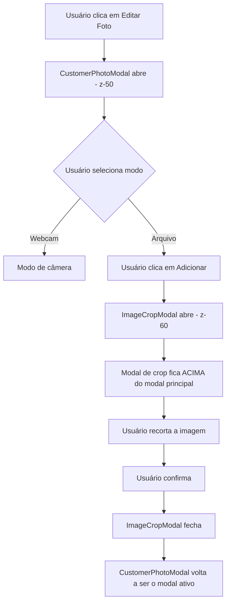

# Plano: Correção do Z-index do Modal de Foto do Cliente

## Problema Identificado

Na tela de administração de clientes (`http://localhost:3000/admin/customers`), quando o modal de atualização de foto do cliente está aberto e o usuário clica no botão "Adicionar" (para selecionar um arquivo), o modal de recorte de imagem (`ImageCropModal`) fica abaixo do modal principal (`CustomerPhotoModal`).

### Causa Raiz

Ambos os modais utilizam o mesmo valor de `z-50`:

1. **CustomerPhotoModal** ([`CustomerPhotoModal.tsx:153`](app/admin/customers/components/CustomerPhotoModal.tsx:153)):
   ```tsx
   <div className="fixed inset-0 z-50 bg-black/60 backdrop-blur-sm flex items-center justify-center p-4">
   ```

2. **ImageCropModal** ([`ImageCropModal.tsx:244`](app/components/ImageCropModal.tsx:244)):
   ```tsx
   <div className="fixed inset-0 z-50 bg-black/50 backdrop-blur-sm flex items-center justify-center p-4">
   ```

Como o `ImageCropModal` é renderizado dentro do `CustomerPhotoModal`, ambos têm o mesmo nível de empilhamento, causando o conflito de sobreposição.

## Solução Proposta

Ajustar o z-index do `ImageCropModal` para um valor maior que o `CustomerPhotoModal`, garantindo que o modal de recorte sempre fique acima do modal principal quando estiver aberto.

### Hierarquia de Z-index Proposta

| Componente | Z-index Atual | Z-index Proposto | Justificativa |
|------------|---------------|------------------|----------------|
| CustomerFormDialog (Dialog) | 50 | 50 | Mantido como base (usa Radix UI Portal) |
| CustomerPhotoModal (overlay) | 50 | 100 | Aumentado para ficar acima do CustomerFormDialog |
| CustomerPhotoModal (Card) | - | 100 | Aumentado para corresponder ao overlay |
| ImageCropModal (overlay) | 50 | 9999 | Aumentado drasticamente para ficar acima de todos os contextos |
| ImageCropModal (Card) | - | 9999 | Aumentado para corresponder ao overlay |

## Implementação

### Arquivos a Modificar

1. **[`app/admin/customers/components/CustomerPhotoModal.tsx`](app/admin/customers/components/CustomerPhotoModal.tsx:153)**
2. **[`app/components/ImageCropModal.tsx`](app/components/ImageCropModal.tsx:244)**
3. **[`app/components/CustomerFormDialog.tsx`](app/components/CustomerFormDialog.tsx:142)**

### Mudanças Necessárias

#### 1. CustomerPhotoModal.tsx

**Linha 153** - Alterar o z-index do overlay principal:

```tsx
// ANTES:
<div className="fixed inset-0 z-50 bg-black/60 backdrop-blur-sm flex items-center justify-center p-4">

// DEPOIS:
<div className="fixed inset-0 z-[100] bg-black/60 backdrop-blur-sm flex items-center justify-center p-4">
```

**Linha 154** - Adicionar z-index ao Card para corresponder ao overlay:

```tsx
// ANTES:
<div className="w-full max-w-lg bg-white rounded-2xl shadow-2xl border border-gray-200/50 overflow-hidden flex flex-col max-h-[90vh]">

// DEPOIS:
<div className="w-full max-w-lg bg-white rounded-2xl shadow-2xl border border-gray-200/50 overflow-hidden flex flex-col max-h-[90vh] relative z-[100]">
```

#### 2. ImageCropModal.tsx

**Linha 244** - Alterar o z-index do overlay principal:

```tsx
// ANTES:
<div className="fixed inset-0 z-50 bg-black/50 backdrop-blur-sm flex items-center justify-center p-4">

// DEPOIS:
<div className="fixed inset-0 z-[9999] bg-black/50 backdrop-blur-sm flex items-center justify-center p-4">
```

**Linha 252** - Adicionar z-index ao Card para corresponder ao overlay:

```tsx
// ANTES:
<Card className="w-full max-w-4xl max-h-[90vh] bg-white shadow-2xl border-0 flex flex-col">

// DEPOIS:
<Card className="w-full max-w-4xl max-h-[90vh] bg-white shadow-2xl border-0 flex flex-col relative z-[9999]">
```

#### 3. CustomerFormDialog.tsx

**Linha 142** - Fechar o Dialog quando o CustomerPhotoModal está aberto:

```tsx
// ANTES:
<Dialog open={open} onOpenChange={(v) => !v && onClose()}>

// DEPOIS:
<Dialog open={open && !photoModalOpen} onOpenChange={(v) => !v && onClose()}>
```

**Após a função handlePhotoSelected** - Adicionar funções para controlar o modal de foto:

```tsx
const handlePhotoModalOpen = () => {
  setPhotoModalOpen(true);
};

const handlePhotoModalClose = () => {
  setPhotoModalOpen(false);
};
```

**Linha 218** - Atualizar o botão para usar a nova função:

```tsx
// ANTES:
onClick={() => setPhotoModalOpen(true)}

// DEPOIS:
onClick={handlePhotoModalOpen}
```

**Linha 530** - Atualizar o CustomerPhotoModal para usar a nova função:

```tsx
// ANTES:
onClose={() => setPhotoModalOpen(false)}

// DEPOIS:
onClose={handlePhotoModalClose}
```

## Considerações Adicionais

1. **Contexto de Empilhamento**: O problema foi mais complexo do que inicialmente identificado. O [`CustomerFormDialog`](app/components/CustomerFormDialog.tsx:142) usa o componente `Dialog` do shadcn/ui, que por sua vez utiliza `DialogPortal` do Radix UI. Isso cria um novo contexto de empilhamento no DOM, o que significa que z-indexes simples não funcionam como esperado entre contextos diferentes.

2. **Overlay Bloqueando Cliques**: O overlay do Dialog do Radix UI estava bloqueando os cliques no CustomerPhotoModal, mesmo quando o CustomerPhotoModal tinha um z-index maior. A solução foi fechar o Dialog quando o CustomerPhotoModal está aberto, removendo o overlay que bloqueava os eventos.

3. **Z-index Alto**: O valor `z-[9999]` foi escolhido para garantir que o modal de crop fique acima de todos os contextos de empilhamento possíveis na aplicação, independentemente de onde o modal seja renderizado.

4. **Escalabilidade**: Se no futuro houver necessidade de modais aninhados mais profundos, a hierarquia pode ser expandida (ex: z-[9998], z-[9997], etc.), mantendo sempre valores altos para evitar conflitos.

5. **Compatibilidade**: As mudanças são localizadas e não afetam outros componentes que utilizam o `ImageCropModal`, pois o z-index alto garante que o modal sempre ficará acima de qualquer outro elemento.

## Testes Recomendados

Após a implementação, verificar:

1. ✅ Abrir o modal de foto do cliente
2. ✅ Clicar no botão "Arquivo" para abrir o modal de upload
3. ✅ Confirmar que o modal de recorte aparece acima do modal principal
4. ✅ Testar o fluxo completo: selecionar imagem → recortar → confirmar
5. ✅ Verificar que o modal de fechamento funciona corretamente
6. ✅ Testar o modo de webcam para garantir que não foi afetado

## Diagrama de Fluxo



## Resumo

A correção envolve sete alterações em três arquivos:

### [`app/admin/customers/components/CustomerPhotoModal.tsx`](app/admin/customers/components/CustomerPhotoModal.tsx)
1. **Linha 153**: Alterar o z-index do overlay de `z-50` para `z-[100]`
2. **Linha 154**: Adicionar `relative z-[100]` ao Card interno

### [`app/components/ImageCropModal.tsx`](app/components/ImageCropModal.tsx)
3. **Linha 244**: Alterar o z-index do overlay de `z-50` para `z-[9999]`
4. **Linha 252**: Adicionar `relative z-[9999]` ao Card interno

### [`app/components/CustomerFormDialog.tsx`](app/components/CustomerFormDialog.tsx)
5. **Linha 142**: Fechar o Dialog quando o CustomerPhotoModal está aberto (`open && !photoModalOpen`)
6. **Após handlePhotoSelected**: Adicionar funções `handlePhotoModalOpen` e `handlePhotoModalClose`
7. **Linhas 218 e 530**: Atualizar botão e CustomerPhotoModal para usar as novas funções

Essas mudanças garantem que:
- O `CustomerPhotoModal` fique acima do `CustomerFormDialog`
- O `ImageCropModal` fique acima do `CustomerPhotoModal`
- O overlay do Dialog não bloqueie os cliques no CustomerPhotoModal
- Todos os modais funcionem corretamente, independentemente dos contextos de empilhamento criados pelos portais do Radix UI
