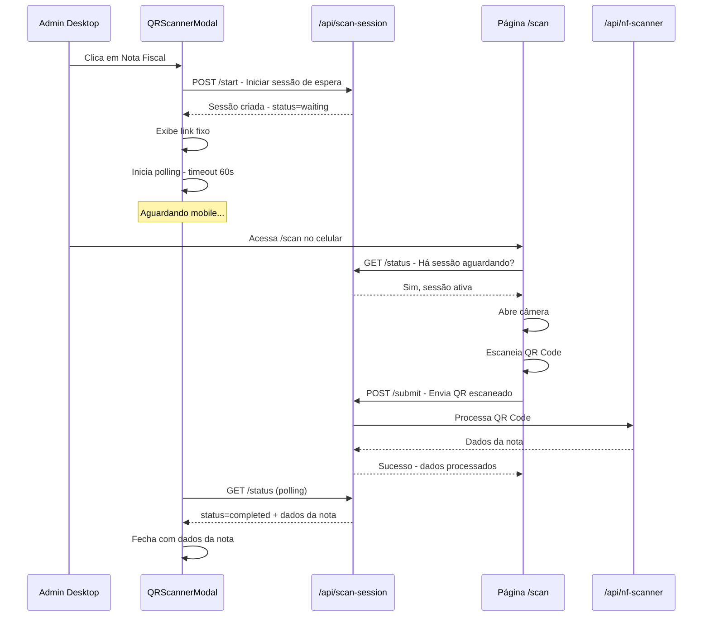

# Plano de Implementação: Scanner QR Code Mobile para Notas Fiscais

## 1. Visão Geral

### Objetivo
Substituir a funcionalidade de webcam no `QRScannerModal` por um sistema de link fixo que permite usar a câmera do celular para capturar QR Codes de notas fiscais.

### Requisitos
- ✅ Descontinuar uso da webcam para QR Code de notas fiscais
- ✅ Link fixo para captura mobile (sempre o mesmo)
- ✅ Opção de copiar o link para compartilhamento
- ✅ Modal aguarda resposta por até 1 minuto
- ✅ Sistema de "aguardando leitura" para sincronizar desktop e mobile
- ✅ Preparar estrutura para futuro leitor de código de barras

---

## 2. Arquitetura Simplificada

### Conceito
```
┌─────────────────────────────────────────────────────────────────────┐
│                      ExpenseFormDialog                              │
│  ┌─────────────────────────────────────────────────────────────┐    │
│  │  Botão "Nota Fiscal" dentro do campo Valor                  │    │
│  └──────────────────────────┬──────────────────────────────────┘    │
│                             │                                       │
│                             ▼                                       │
│  ┌────────────────────────────────────────────────────────────────┐ │
│  │                    QRScannerModal                              │ │
│  │                                                                │ │
│  │  ┌──────────────────────────────────────────────────────────┐ │ │
│  │  │  🔗 Link: https://app.com/scan                           │ │ │
│  │  │  [📋 Copiar Link]                                        │ │ │
│  │  │                                                          │ │ │
│  │  │  ⏱️ Aguardando escaneamento... (00:45)                   │ │ │
│  │  │  [Cancelar]                                              │ │ │
│  │  └──────────────────────────────────────────────────────────┘ │ │
│  │                                                                │ │
│  │  Ao abrir: POST /api/scan-session → status=waiting            │ │
│  │  Polling: GET /api/scan-session/status → aguarda resultado    │ │
│  └────────────────────────────────────────────────────────────────┘ │
└─────────────────────────────────────────────────────────────────────┘
                              │
                              │ (link fixo)
                              ▼
        ┌──────────────────────────────────────────────┐
        │          Página Mobile (/scan)                │
        │  ┌────────────────────────────────────────┐  │
        │  │  1. Verifica se há sessão aguardando   │  │
        │  │  2. Se sim, abre câmera do celular     │  │
        │  │  3. Escaneia QR Code                   │  │
        │  │  4. Envia resultado para API           │  │
        │  │  5. Exibe confirmação                  │  │
        │  └────────────────────────────────────────┘  │
        └──────────────────────────────────────────────┘
```

### Fluxo de Dados



---

## 3. Estrutura de Arquivos

### Arquivos a Serem Criados

```
app/
├── scan/
│   └── page.tsx                  # Página mobile de captura (link fixo)
│
├── api/
│   └── scan-session/
│       └── route.ts              # API unificada: start/status/submit
│
├── components/
│   └── QRScannerModal.tsx        # MODIFICAR - remover webcam, adicionar link
│
lib/
└── scan-session/
    ├── types.ts                  # Tipos da sessão de scan
    └── store.ts                  # Armazenamento temporário
```

### Arquivos a Serem Modificados

| Arquivo | Mudança |
|---------|---------|
| `app/components/QRScannerModal.tsx` | Remover modo webcam, adicionar modo Link Mobile |

---

## 4. API de Sessão de Scan

### `POST /api/scan-session` - Iniciar/Submeter

```typescript
// Ação: start - Iniciar sessão de espera
// Request
{
  action: 'start'
}

// Response
{
  success: true,
  sessionId: 'uuid',
  expiresIn: 60,
  scanUrl: 'https://domain.com/scan'  // Link fixo
}

// Ação: submit - Enviar resultado do scan
// Request
{
  action: 'submit',
  sessionId: 'uuid',
  qrData: 'url-do-qrcode-da-nota'
}

// Response
{
  success: true,
  message: 'QR Code processado com sucesso'
}
```

### `GET /api/scan-session` - Verificar Status

```typescript
// Para o Modal (polling)
// GET /api/scan-session?sessionId=xxx

// Response (aguardando)
{
  status: 'waiting',
  expiresIn: 45
}

// Response (completado)
{
  status: 'completed',
  result: {
    invoiceData: InvoiceData
  }
}

// Response (expirado)
{
  status: 'expired'
}

// Para a Página Mobile (verificar se há sessão)
// GET /api/scan-session?checkWaiting=true

// Response
{
  hasWaitingSession: true,
  sessionId: 'uuid',
  expiresIn: 45
}
```

---

## 5. Store de Sessão

```typescript
// lib/scan-session/store.ts

interface ScanSession {
  id: string;
  status: 'waiting' | 'completed' | 'expired';
  createdAt: Date;
  expiresAt: Date;
  result?: InvoiceData;
}

// Armazenamento em memória (simples)
const sessions = new Map<string, ScanSession>();

// Funções
export function createSession(): ScanSession;
export function getSession(id: string): ScanSession | null;
export function submitScanResult(id: string, qrData: string): Promise<InvoiceData>;
export function cleanExpiredSessions(): void;
export function getWaitingSession(): ScanSession | null;
```

---

## 6. Layout dos Componentes

### 6.1. QRScannerModal Atualizado

```
┌─────────────────────────────────────────────────────┐
│  Escanear QR Code                            [X]    │
├─────────────────────────────────────────────────────┤
│                                                     │
│  [📱 Link Mobile]  [📤 Upload]  [📊 Barcode*]       │
│                                                     │
│  ─────────────────────────────────────────────────  │
│                                                     │
│  MODO LINK MOBILE:                                  │
│                                                     │
│  ┌─────────────────────────────────────────────┐   │
│  │                                             │   │
│  │  🔗 Link para Captura Mobile                │   │
│  │                                             │   │
│  │  Acesse este link no seu celular:          │   │
│  │                                             │   │
│  │  ┌─────────────────────────────────────┐   │   │
│  │  │ https://seusite.com/scan            │   │   │
│  │  └─────────────────────────────────────┘   │   │
│  │                                             │   │
│  │  [📋 Copiar Link]                          │   │
│  │                                             │   │
│  │  ─────────────────────────────────────────  │   │
│  │                                             │   │
│  │  ⏱️ Aguardando escaneamento...              │   │
│  │                                             │   │
│  │  Expira em: 00:45                           │   │
│  │                                             │   │
│  │  [Cancelar]                                 │   │
│  │                                             │   │
│  └─────────────────────────────────────────────┘   │
│                                                     │
│  * Barcode: disponível em breve                     │
│                                                     │
└─────────────────────────────────────────────────────┘
```

### 6.2. Página Mobile (`/scan`)

```
┌─────────────────────────────────┐
│  📷 Escanear QR Code            │
│                                 │
│  ┌───────────────────────────┐  │
│  │                           │  │
│  │     Área da Câmera        │  │
│  │     com overlay           │  │
│  │       ┌─────────┐         │  │
│  │       │  QR     │         │  │
│  │       │  Frame  │         │  │
│  │       └─────────┘         │  │
│  │                           │  │
│  └───────────────────────────┘  │
│                                 │
│  Aponte a câmera para o QR     │
│  Code da nota fiscal            │
│                                 │
│  ⏱️ Sessão expira em: 00:45     │
│                                 │
│  [Cancelar]                     │
└─────────────────────────────────┘

Estado: Aguardando sessão
┌─────────────────────────────────┐
│  ⚠️ Nenhuma sessão ativa        │
│                                 │
│  Abra o modal de despesas no    │
│  computador e clique em         │
│  "Nota Fiscal" para iniciar.    │
│                                 │
│  [Atualizar]                    │
└─────────────────────────────────┘

Estado: Sucesso
┌─────────────────────────────────┐
│  ✅ QR Code Escaneado!          │
│                                 │
│  Os dados da nota fiscal foram  │
│  enviados com sucesso.          │
│                                 │
│  Você pode fechar esta página.  │
└─────────────────────────────────┘
```

---

## 7. Preparação para Futuro: Código de Barras

### Interface Genérica
```typescript
interface ScanSession {
  id: string;
  type: 'qrcode' | 'barcode';  // Extensível
  status: 'waiting' | 'completed' | 'expired';
  createdAt: Date;
  expiresAt: Date;
  result?: ScanResult;
}

interface ScanResult {
  type: 'qrcode' | 'barcode';
  rawValue: string;
  parsedData?: InvoiceData | ProductData;
}
```

### Abas no Modal
```typescript
type ScanMode = 'mobile-link' | 'upload' | 'barcode';

// Futuramente adicionar:
// - barcode: Scanner dedicado para código de barras de produtos
```

---

## 8. Dependências

### Frontend (Página Mobile)
```bash
npm install html5-qrcode
# ou
npm install @zxing/library
```

---

## 9. Tarefas de Implementação

### Fase 1: Infraestrutura
- [ ] Criar `lib/scan-session/types.ts` - Tipos TypeScript
- [ ] Criar `lib/scan-session/store.ts` - Store em memória

### Fase 2: API
- [ ] Criar `app/api/scan-session/route.ts`
  - [ ] POST action=start - Criar sessão waiting
  - [ ] POST action=submit - Receber resultado do mobile
  - [ ] GET sessionId=xxx - Status para polling do modal
  - [ ] GET checkWaiting=true - Verificar sessão ativa para mobile

### Fase 3: Página Mobile
- [ ] Criar `app/scan/page.tsx`
  - [ ] Verificar sessão aguardando
  - [ ] Interface de câmera com html5-qrcode
  - [ ] Enviar resultado para API
  - [ ] Estados: aguardando, escaneando, sucesso, erro

### Fase 4: Modal Atualizado
- [ ] Modificar `app/components/QRScannerModal.tsx`
  - [ ] Remover modo webcam
  - [ ] Adicionar modo "Link Mobile"
  - [ ] Exibir link fixo + botão copiar
  - [ ] Criar sessão ao abrir
  - [ ] Implementar polling de status
  - [ ] Timer de expiração (60s)
  - [ ] Preparar aba "Barcode" desabilitada

### Fase 5: Testes
- [ ] Testar fluxo completo desktop → mobile
- [ ] Testar expiração de sessão
- [ ] Testar em iOS Safari
- [ ] Testar em Android Chrome
- [ ] Testar cópia de link

---

## 10. Considerações Técnicas

### Segurança
- Sessão expira em 60 segundos
- Apenas uma sessão ativa por vez
- Limpar sessões expiradas automaticamente

### Performance
- Polling intervalo: 2 segundos
- Limpeza de sessões expiradas a cada requisição

### Compatibilidade Mobile
- HTTPS obrigatório para câmera
- Testar permissões em iOS e Android
- Fallback para navegadores sem suporte

---

## 11. Exemplo de Código

### Store de Sessão
```typescript
// lib/scan-session/store.ts
import { v4 as uuidv4 } from 'uuid';
import { InvoiceData } from '@/lib/nf-scanner/types';

export type ScanType = 'qrcode' | 'barcode';
export type ScanStatus = 'waiting' | 'completed' | 'expired';

export interface ScanSession {
  id: string;
  type: ScanType;
  status: ScanStatus;
  createdAt: Date;
  expiresAt: Date;
  result?: InvoiceData;
}

const SESSION_DURATION_MS = 60 * 1000; // 60 segundos
const sessions = new Map<string, ScanSession>();

export function createSession(type: ScanType = 'qrcode'): ScanSession {
  // Limpar sessões expiradas
  cleanExpiredSessions();
  
  // Criar nova sessão
  const id = uuidv4();
  const now = new Date();
  const session: ScanSession = {
    id,
    type,
    status: 'waiting',
    createdAt: now,
    expiresAt: new Date(now.getTime() + SESSION_DURATION_MS),
  };
  
  sessions.set(id, session);
  return session;
}

export function getSession(id: string): ScanSession | null {
  const session = sessions.get(id);
  if (!session) return null;
  
  // Verificar expiração
  if (new Date() > session.expiresAt) {
    session.status = 'expired';
  }
  
  return session;
}

export function getWaitingSession(): ScanSession | null {
  cleanExpiredSessions();
  
  for (const session of sessions.values()) {
    if (session.status === 'waiting') {
      return session;
    }
  }
  
  return null;
}

export async function submitScanResult(
  id: string, 
  qrData: string
): Promise<InvoiceData> {
  const session = getSession(id);
  if (!session) {
    throw new Error('Sessão não encontrada');
  }
  
  if (session.status === 'expired') {
    throw new Error('Sessão expirada');
  }
  
  // Processar QR Code via API existente
  const response = await fetch('/api/nf-scanner/process-qr', {
    method: 'POST',
    body: JSON.stringify({ qrData }),
  });
  
  if (!response.ok) {
    throw new Error('Erro ao processar QR Code');
  }
  
  const { data } = await response.json();
  
  // Atualizar sessão
  session.status = 'completed';
  session.result = data;
  
  return data;
}

export function cleanExpiredSessions(): void {
  const now = new Date();
  for (const [id, session] of sessions.entries()) {
    if (now > session.expiresAt) {
      sessions.delete(id);
    }
  }
}
```

---

## 12. Resumo

Esta implementação simplificada:

1. **Remove complexidade** - Link fixo, sem tokens JWT
2. **Mantém segurança** - Sessões de 60 segundos
3. **Prepara futuro** - Interface extensível para barcode
4. **Preserva UX** - Botão continua no campo de valor
5. **Fácil manutenção** - Store em memória, código simples
