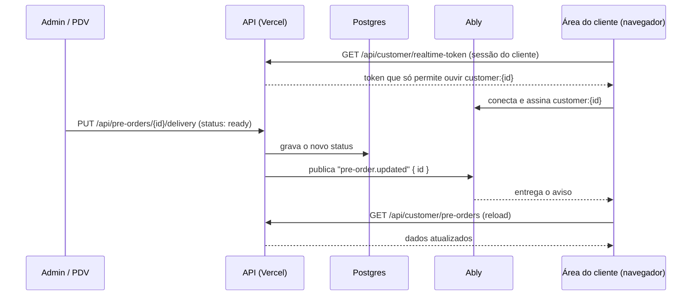

# Plano de Implementação — Atualização em tempo real na área do cliente

> Data: 2026-10-02 · revisado em 2026-10-08
> Status: Planejamento (não implementado)
> Depende de: nova área do cliente (`feat/area-cliente-v2`); a Fase 2 depende também do centro de notificações do admin (`feat/notificacoes-intencao-pagamento`)

---

## Objetivo

Quando algo muda para o cliente, a tela dele deve mudar em segundos, sem recarregar:

- o pedido avança de status ("Em preparo" → "Pronto para retirar", "A caminho" → "Entregue");
- entra uma compra na ficha ou um pagamento é registrado, e o saldo muda;
- o cliente toca "Já paguei" no PIX e o painel do admin recebe o aviso na hora (Fase 2, ver a revisão abaixo).

## Revisão de 08/10/2026: o que mudou desde o plano

Desde 02/10 surgiram três consumidores que o plano original não tinha. Todos hoje usam polling, e todos têm um ponto de encaixe único:

| Consumidor | Hoje | Ponto de encaixe |
|---|---|---|
| Sino de avisos do cliente | polling de 60 s e ao voltar para a aba | `loadNotices()` em `app/customer/lib/notifications-store.ts` |
| Sino do admin (centro de notificações) | polling de 30 s e ao voltar para a aba | `refresh()` em `app/admin/components/notifications/useNotifications.ts` |
| Pedidos / Início / Ficha | 30 s só em Pedidos; Início e Ficha só ao abrir | `reload()` de `useCustomerData` |

O feed de avisos do cliente é **derivado** de pedidos e ficha (não há tabela de avisos). Por isso um evento de pedido ou de ficha já basta para atualizar o sino: o navegador recebe o sinal e chama `loadNotices()`, sem novo evento nem nova tabela.

### O que isso muda no plano

1. **A pergunta "Já paguei" notifica o estabelecimento?** foi respondida: sim, a PR #47 já cria a notificação para o operador. O canal `staff:notifications` deixa de ser "futuro" e vira a **Fase 2**.
2. **Eventos novos**, além dos da tabela original:

| Canal | Evento | Quando publicar | Efeito |
|---|---|---|---|
| `staff:notifications` | `notification.created` | `POST /api/customer/payment-intents` (cliente informa o PIX) | o sino do admin chama `refresh()` na hora, em vez de esperar até 30 s |
| `customer:{id}` | `ficha.updated` | `POST /api/payment-intents/[id]/confirm` (o operador confirma e o pagamento entra na ficha) | saldo, Ficha e avisos do cliente se atualizam sozinhos |
| `customer:{id}` | `payment-intent.updated` | `confirm` e `reject` | a tela de PIX do cliente sai de "em análise" sem recarregar |

3. **Um só provedor de eventos no navegador.** Em vez de um hook por tela, o `CustomerShell` abre **uma** conexão e reparte os eventos por contexto. Cada tela se inscreve no que precisa (`useRealtimeEvent("pre-order", reload)`). O sino do cliente se inscreve em `pre-order` e em `ficha`.
4. **Publicar na rota, de forma explícita.** Foi considerada a alternativa de publicar por uma extensão do Prisma (`$extends`), que pegaria toda escrita sem editar cada rota. Fica descartada por ora: dispararia também nas atualizações de localização do entregador, que são frequentes e gastariam a cota, e esconderia de onde sai cada aviso. Uma chamada visível por rota é mais fácil de auditar.

### Por que não só encurtar o polling

Um endpoint "pulso" (`GET /api/customer/pulse`, devolvendo só um número de versão barato e recarregando os dados quando ele muda) daria sensação de tempo real sem serviço externo. Mas cada cliente com o app aberto vira uma chamada a cada poucos segundos: 100 clientes simultâneos a cada 15 s são cerca de 400 chamadas por minuto, perto de 190 mil por dia, e o plano Hobby da Vercel tem 1 milhão de invocações por mês. Serve como ponte para poucos clientes; o push do Ably custa uma mensagem por mudança, não por segundo de espera.

### Como ficou a Fase 1 (implementada em 08/10/2026)

- **Navegador sem biblioteca.** O pacote `ably` no navegador não passa no build do Next (o SWC quebra um `super()` dentro de função de seta no construtor). Em vez disso o navegador usa o canal de eventos nativo do Ably (`EventSource` em `realtime.ably.io/event-stream`), que também reconecta sozinho. O `ably` fica só no servidor.
- **Token.** `GET /api/customer/realtime-token` devolve um token de 1 hora que só permite **ouvir** `customer:{id}`. O navegador pede outro 5 minutos antes de vencer e, se a conexão cair, tenta de novo com espera crescente.
- **A chave do servidor precisa de permissão de publicar.** A chave "somente assinar" que o Ably cria por padrão emite tokens, mas não publica: o servidor recebe "Unauthorized to publish to channel" (registrado no log, sem derrubar a rota).

### Fases

| Fase | Entrega | O que o cliente percebe |
|---|---|---|
| **1. Cliente** | `lib/realtime.ts`, rota de token, provedor no `CustomerShell`, publicação nas rotas de pedido, ficha e pagamento; Pedidos, Início, Ficha e o sino passam a reagir | o pedido muda de etapa, o saldo e o selo do sino mudam sozinhos em até ~2 s |
| **2. Operador** | rota de token de staff (`requireStaff()`), canal `staff:notifications`, `refresh()` do sino do admin ligado | o aviso de "cliente informou PIX" aparece na hora para quem está no painel |
| **3. Mapa** (opcional) | posição do entregador em tempo real | o ponto se move sem esperar 15 s; outra conta de mensagens, decidir depois |

Cada fase é independente e, sem `ABLY_API_KEY`, tudo continua funcionando com o polling atual.

### Decisões que dependem de você

1. **Criar a conta no Ably** (gratuita, sem cartão) e a chave, quando a Fase 1 for liberada. Sem isso não há como testar de ponta a ponta.
2. **Ably ou Pusher.** A recomendação continua sendo o Ably; trocar depois mexe só em `lib/realtime.ts` e no provedor.
3. **A Fase 2 entra junto com a 1 ou depois?** Recomendo depois, para a PR da Fase 1 ficar pequena e só do cliente.

---

## Como é hoje

A área do cliente atualiza por consulta periódica (polling):

| Tela | Atualização |
|---|---|
| Pedidos (`/customer/pre-orders`) | a cada 30 s enquanto houver pedido em andamento e a aba estiver visível |
| Início e Ficha | só ao abrir a tela ou tocar em "Tentar de novo" |

Cada busca usa `useCustomerData` (`app/customer/lib/useCustomerData.ts`), que expõe `reload()`. Esse `reload()` é o ponto de encaixe deste plano.

## Por que não WebSocket na própria Vercel

A Vercel aceita WebSocket e SSE nas Functions (com Fluid compute), mas com duas travas:

- **Duração:** a conexão fecha quando a função atinge a duração máxima, que no plano Hobby é de 300 s e não pode ser aumentada. O cliente precisa reconectar o tempo todo.
- **Custo e estado:** cada cliente conectado mantém uma função rodando, consumindo o limite do plano. Com mais de uma instância, um pub/sub externo continua necessário para todas saberem das mudanças.

SSE sozinho também não resolve: para saber quando enviar, a função teria de consultar o banco em loop por cliente conectado.

## Decisão: serviço gerenciado de pub/sub

O servidor só **publica** um aviso por HTTP (sem conexão longa), e o navegador mantém a conexão com o serviço, não com a Vercel.

| Serviço | Plano gratuito (consultado em 02/10/2026) |
|---|---|
| **Ably** (recomendado) | 200 conexões simultâneas, 6 milhões de mensagens/mês, 200 canais simultâneos, sem cartão |
| Pusher Channels (Sandbox) | 100 conexões simultâneas, 200 mil mensagens/dia |

A recomendação é o Ably, que tem mais folga no gratuito e autenticação por token com permissão por canal. O Pusher atende do mesmo jeito; trocar de um para o outro afeta só `lib/realtime.ts` e o hook do navegador.

Conexões simultâneas contam **clientes com o app aberto ao mesmo tempo**, não clientes cadastrados.

## Arquitetura

### Princípios

1. **O aviso é um sinal, não um dado.** A mensagem leva só o tipo do evento e um id. Valores, itens e status são buscados nas APIs atuais, com a autenticação de sempre. Nada sensível passa pelo serviço externo.
2. **Um canal por cliente.** `customer:{customerId}`. O token emitido para o cliente só permite **assinar** o próprio canal; ele não publica nem ouve o canal de outra pessoa.
3. **Publicar depois de gravar.** O aviso sai só depois que a escrita no banco deu certo.
4. **Falha ao publicar não derruba a operação.** O publish fica num `try/catch` com log. O polling cobre a falha.
5. **Polling continua como rede de segurança.** Conectado ao serviço, o intervalo de Pedidos sobe de 30 s para 2 min. Sem conexão (serviço fora, limite estourado ou chave ausente), volta para 30 s.

## Canais e eventos

| Canal | Evento | Dados | Quem ouve | Efeito na tela |
|---|---|---|---|---|
| `customer:{customerId}` | `pre-order.updated` | `{ id }` | o cliente | Pedidos e Início chamam `reload()`; o detalhe aberto se atualiza |
| `customer:{customerId}` | `ficha.updated` | `{}` | o cliente | Início e Ficha chamam `reload()`; o saldo conta até o novo valor |
| `staff:notifications` | `notification.created` | `{ id }` | admin e PDV logados | o sino chama `refresh()` e mostra o aviso na hora, em vez de esperar os 30 s |
| `customer:{customerId}` | `payment-intent.reviewed` | `{ id }` | o cliente | o cartão "aguardando confirmação" do Início vira "confirmado" ou "recusado" na hora |

O "Já paguei" **já notifica o estabelecimento**: ele cria uma `PaymentIntent` e uma `Notification` (ver `app/api/customer/payment-intents/route.ts`), e o operador revisa pelo sino do admin. O que faltava era trocar a consulta de 30 s por esses dois eventos (Fase 2).

## Onde publicar

| Rota | Método | Quando publicar | Evento |
|---|---|---|---|
| `app/api/pre-orders/[id]/delivery/route.ts` | `PUT` | **só quando `status` mudar**. Atualizações apenas de localização (latitude/longitude do entregador) **não** publicam: são frequentes e gastariam a cota à toa | `pre-order.updated` |
| `app/api/pre-orders/route.ts` | `POST`, `PUT`, `DELETE` | quando o pré-pedido tiver `customerId` | `pre-order.updated` |
| `app/api/orders/route.ts` | `POST` | quando a venda for para a ficha (`paymentMethod: invoice`, status `pending`) e tiver `customerId` | `ficha.updated` |
| `app/api/orders/route.ts` | `PUT`, `DELETE` | quando o pedido alterado for de um cliente | `ficha.updated` |
| `app/api/ficha-payments/route.ts` | `POST`, `DELETE` | sempre (pagamento sempre tem `customerId`) | `ficha.updated` |
| `app/api/customer/payment-intents/route.ts` | `POST` | depois de criar a intenção | `notification.created` (canal dos funcionários) |
| `app/api/payment-intents/[id]/confirm` e `reject` | `POST` | depois de revisar | `payment-intent.reviewed` (canal do cliente) e, no confirmar, também `ficha.updated` |

O rastreio no mapa (`/customer/pre-orders/[id]/tracking`) continua com o polling de 15 s que já tem. Levar a posição do entregador para o tempo real é outro passo, com outra conta de mensagens.

## Arquivos

### Novos

- **`lib/realtime.ts`** (servidor): `publishToCustomer(customerId, event, data?)`.
  - Usa o cliente REST do Ably com `ABLY_API_KEY`.
  - Sem a variável, vira no-op: o sistema funciona igual a hoje, só com polling.
  - Nunca lança erro para quem chamou.
- **`app/api/customer/realtime-token/route.ts`** (`GET`): exige `getCustomerSession()`.
  - Devolve um *token request* do Ably com `clientId` igual ao `customerId`, capacidade `{ "customer:{id}": ["subscribe"] }` e validade de 1 hora (o SDK renova sozinho).
  - Sem sessão: 401. Sem chave configurada: 204, e o navegador fica só no polling.
- **`app/customer/lib/useCustomerRealtime.ts`** (navegador): `useCustomerRealtime({ onPreOrder, onFicha })`.
  - Carrega o SDK do Ably sob demanda (`import()` dinâmico), autentica via `authUrl: "/api/customer/realtime-token"` e assina o canal do cliente.
  - Devolve `connected`, que as telas usam para ajustar o intervalo do polling.
  - Fecha a conexão ao sair da área do cliente.

### Alterados

- As rotas da tabela "Onde publicar": uma chamada a `publishToCustomer` depois da escrita.
- `app/customer/dashboard/page.tsx`, `app/customer/expenses/page.tsx`, `app/customer/pre-orders/page.tsx`: usar o hook e chamar `reload()` nos eventos. O ideal é o hook viver uma vez no `CustomerShell` e repassar os eventos por contexto, para não abrir uma conexão por tela.
- `docker-compose.yml`: repassar `ABLY_API_KEY: ${ABLY_API_KEY:-}` ao serviço `app`.

### Dependência

- `ably` (npm): um pacote só para o servidor (REST) e o navegador (Realtime). No navegador ele entra por `import()` dinâmico, para não pesar a primeira carga.

## Configuração

| Variável | Onde | Observação |
|---|---|---|
| `ABLY_API_KEY` | `.env` local, Vercel (Production e Preview), compose | **Só servidor.** Nunca usar prefixo `NEXT_PUBLIC_`: o navegador recebe apenas tokens temporários. |

Passos para ativar:

1. Criar conta gratuita no Ably e um app "viandas-e-marmitex".
2. Criar uma API key com permissões `publish` e `subscribe` (a de assinar é necessária para emitir tokens de assinatura).
3. Colocar a chave em `ABLY_API_KEY` no `.env` e nas variáveis da Vercel.
4. Fazer o deploy. Sem a chave, nada muda.

## Segurança

- **Isolamento:** o cliente só recebe token se estiver logado, e o token só permite ouvir o próprio canal. O Ably recusa a assinatura de qualquer outro canal.
- **Dados mínimos:** as mensagens não carregam dados pessoais nem valores; um vazamento do canal revelaria só que "algo mudou".
- **Chave:** a API key fica só no servidor.

## Limites e custo estimado

O Ably conta mensagens publicadas e entregues. Uma estimativa folgada para a operação:

- 60 pedidos/dia × 5 mudanças de status × 2 (publicação + entrega) ≈ 600 mensagens/dia.
- Com compras e pagamentos na ficha, algo como 1.000 mensagens/dia ≈ **30 mil/mês**, cerca de 0,5% do gratuito (6 milhões).

O limite que pode apertar primeiro é o de **conexões simultâneas** (200). Se for atingido, novas conexões são recusadas e essas telas ficam no polling de 30 s. O painel do Ably mostra o pico; se passar de ~150 com frequência, é hora de rever o plano.

## Como testar

1. Com a chave no `.env` local, abrir a área do cliente logado como um cliente com pedido em andamento.
2. No admin, mudar o status do pedido: a tela do cliente muda em até ~2 s, sem recarregar.
3. Registrar um pagamento na ficha do cliente: o saldo do Início e da Ficha muda sozinho.
4. Atualizar só a localização do entregador: **nenhuma** mensagem é publicada (conferir no painel do Ably).
5. Logado como cliente A, tentar assinar `customer:{B}` pelo console do navegador: o Ably recusa.
6. Remover `ABLY_API_KEY` e reiniciar: tudo funciona com polling, sem erros no console.
7. Desligar a rede com a tela aberta: ao voltar, o SDK reconecta e a tela se atualiza.

## Estimativa

Esforço pequeno, cerca de 1 dia de desenvolvimento e testes: um helper no servidor, uma rota de token, um hook, uma linha de publicação por rota e o ajuste do polling nas três telas.

## Em aberto

- **Canal dos funcionários:** `staff:notifications` precisa de uma rota de token própria, que só emite token com a sessão de funcionário (perfil `admin` ou `pdv`, ver `lib/staff-session.ts`).
- **Ably ou Pusher:** a recomendação é Ably; a escolha final é de quem criar a conta.
- **Fase 2 junto ou depois da 1:** ver "Decisões que dependem de você" na revisão de 08/10.
- **Aviso de PIX recusado para o cliente:** o feed de avisos é derivado de pedidos e ficha, então a recusa não aparece como aviso. Se for desejado, o aviso passa a ser derivado também de `PaymentIntent`, uma mudança pequena no feed, independente do tempo real.

## Referências

- [Vercel Functions Limits](https://vercel.com/docs/functions/limitations)
- [Do Vercel Functions support WebSocket connections?](https://vercel.com/kb/guide/do-vercel-serverless-functions-support-websocket-connections)
- [WebSocket vs SSE — Vercel](https://vercel.com/i/websocket-vs-server-sent-events)
- [Ably — preços](https://ably.com/pricing) e [plano gratuito](https://ably.com/docs/platform/pricing/free)
- [Pusher Channels](https://pusher.com/channels/) e [plano Sandbox](https://pusher.com/blog/pushers-sandbox-plan/)
