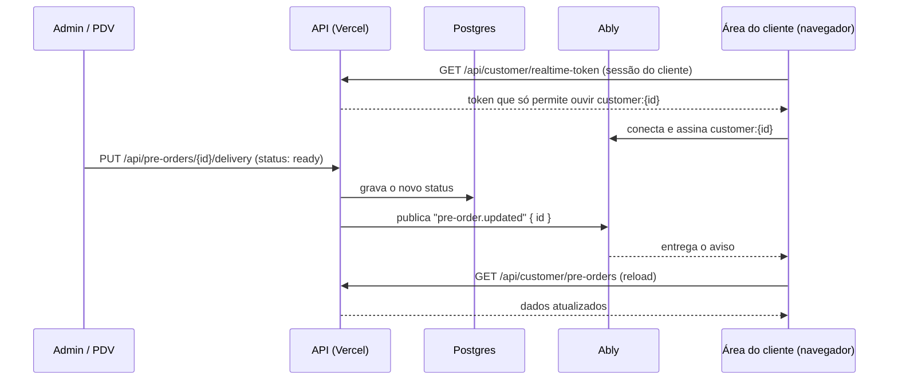

# Plano de Implementação — Atualização em tempo real na área do cliente

> Data: 2026-10-02
> Status: Planejamento (não implementado)
> Depende de: nova área do cliente (`feat/area-cliente-v2`)

---

## Objetivo

Quando algo muda para o cliente, a tela dele deve mudar em segundos, sem recarregar:

- o pedido avança de status ("Em preparo" → "Pronto para retirar", "A caminho" → "Entregue");
- entra uma compra na ficha ou um pagamento é registrado, e o saldo muda;
- (futuro) o cliente toca "Já paguei" no PIX e o painel do admin recebe o aviso na hora.

## Como é hoje

A área do cliente atualiza por consulta periódica (polling):

| Tela | Atualização |
|---|---|
| Pedidos (`/customer/pre-orders`) | a cada 30 s enquanto houver pedido em andamento e a aba estiver visível |
| Início e Ficha | só ao abrir a tela ou tocar em "Tentar de novo" |

Cada busca usa `useCustomerData` (`app/customer/lib/useCustomerData.ts`), que expõe `reload()`. Esse `reload()` é o ponto de encaixe deste plano.

## Por que não WebSocket na própria Vercel

A Vercel aceita WebSocket e SSE nas Functions (com Fluid compute), mas com duas travas:

- **Duração:** a conexão fecha quando a função atinge a duração máxima, que no plano Hobby é de 300 s e não pode ser aumentada. O cliente precisa reconectar o tempo todo.
- **Custo e estado:** cada cliente conectado mantém uma função rodando, consumindo o limite do plano. Com mais de uma instância, um pub/sub externo continua necessário para todas saberem das mudanças.

SSE sozinho também não resolve: para saber quando enviar, a função teria de consultar o banco em loop por cliente conectado.

## Decisão: serviço gerenciado de pub/sub

O servidor só **publica** um aviso por HTTP (sem conexão longa), e o navegador mantém a conexão com o serviço, não com a Vercel.

| Serviço | Plano gratuito (consultado em 02/10/2026) |
|---|---|
| **Ably** (recomendado) | 200 conexões simultâneas, 6 milhões de mensagens/mês, 200 canais simultâneos, sem cartão |
| Pusher Channels (Sandbox) | 100 conexões simultâneas, 200 mil mensagens/dia |

A recomendação é o Ably, que tem mais folga no gratuito e autenticação por token com permissão por canal. O Pusher atende do mesmo jeito; trocar de um para o outro afeta só `lib/realtime.ts` e o hook do navegador.

Conexões simultâneas contam **clientes com o app aberto ao mesmo tempo**, não clientes cadastrados.

## Arquitetura

### Princípios

1. **O aviso é um sinal, não um dado.** A mensagem leva só o tipo do evento e um id. Valores, itens e status são buscados nas APIs atuais, com a autenticação de sempre. Nada sensível passa pelo serviço externo.
2. **Um canal por cliente.** `customer:{customerId}`. O token emitido para o cliente só permite **assinar** o próprio canal; ele não publica nem ouve o canal de outra pessoa.
3. **Publicar depois de gravar.** O aviso sai só depois que a escrita no banco deu certo.
4. **Falha ao publicar não derruba a operação.** O publish fica num `try/catch` com log. O polling cobre a falha.
5. **Polling continua como rede de segurança.** Conectado ao serviço, o intervalo de Pedidos sobe de 30 s para 2 min. Sem conexão (serviço fora, limite estourado ou chave ausente), volta para 30 s.

## Canais e eventos

| Canal | Evento | Dados | Quem ouve | Efeito na tela |
|---|---|---|---|---|
| `customer:{customerId}` | `pre-order.updated` | `{ id }` | o cliente | Pedidos e Início chamam `reload()`; o detalhe aberto se atualiza |
| `customer:{customerId}` | `ficha.updated` | `{}` | o cliente | Início e Ficha chamam `reload()`; o saldo conta até o novo valor |
| `staff:ficha` (futuro) | `pix.informed` | `{ customerId, amountCents }` | admin logado | aviso no painel: "Cliente informou pagamento de R$ X" |

O evento `pix.informed` depende de decidir que o "Já paguei" notifica o estabelecimento (hoje ele só confirma para o cliente).

## Onde publicar

| Rota | Método | Quando publicar | Evento |
|---|---|---|---|
| `app/api/pre-orders/[id]/delivery/route.ts` | `PUT` | **só quando `status` mudar**. Atualizações apenas de localização (latitude/longitude do entregador) **não** publicam: são frequentes e gastariam a cota à toa | `pre-order.updated` |
| `app/api/pre-orders/route.ts` | `POST`, `PUT`, `DELETE` | quando o pré-pedido tiver `customerId` | `pre-order.updated` |
| `app/api/orders/route.ts` | `POST` | quando a venda for para a ficha (`paymentMethod: invoice`, status `pending`) e tiver `customerId` | `ficha.updated` |
| `app/api/orders/route.ts` | `PUT`, `DELETE` | quando o pedido alterado for de um cliente | `ficha.updated` |
| `app/api/ficha-payments/route.ts` | `POST`, `DELETE` | sempre (pagamento sempre tem `customerId`) | `ficha.updated` |

O rastreio no mapa (`/customer/pre-orders/[id]/tracking`) continua com o polling de 15 s que já tem. Levar a posição do entregador para o tempo real é outro passo, com outra conta de mensagens.

## Arquivos

### Novos

- **`lib/realtime.ts`** (servidor): `publishToCustomer(customerId, event, data?)`.
  - Usa o cliente REST do Ably com `ABLY_API_KEY`.
  - Sem a variável, vira no-op: o sistema funciona igual a hoje, só com polling.
  - Nunca lança erro para quem chamou.
- **`app/api/customer/realtime-token/route.ts`** (`GET`): exige `getCustomerSession()`.
  - Devolve um *token request* do Ably com `clientId` igual ao `customerId`, capacidade `{ "customer:{id}": ["subscribe"] }` e validade de 1 hora (o SDK renova sozinho).
  - Sem sessão: 401. Sem chave configurada: 204, e o navegador fica só no polling.
- **`app/customer/lib/useCustomerRealtime.ts`** (navegador): `useCustomerRealtime({ onPreOrder, onFicha })`.
  - Carrega o SDK do Ably sob demanda (`import()` dinâmico), autentica via `authUrl: "/api/customer/realtime-token"` e assina o canal do cliente.
  - Devolve `connected`, que as telas usam para ajustar o intervalo do polling.
  - Fecha a conexão ao sair da área do cliente.

### Alterados

- As rotas da tabela "Onde publicar": uma chamada a `publishToCustomer` depois da escrita.
- `app/customer/dashboard/page.tsx`, `app/customer/expenses/page.tsx`, `app/customer/pre-orders/page.tsx`: usar o hook e chamar `reload()` nos eventos. O ideal é o hook viver uma vez no `CustomerShell` e repassar os eventos por contexto, para não abrir uma conexão por tela.
- `docker-compose.yml`: repassar `ABLY_API_KEY: ${ABLY_API_KEY:-}` ao serviço `app`.

### Dependência

- `ably` (npm): um pacote só para o servidor (REST) e o navegador (Realtime). No navegador ele entra por `import()` dinâmico, para não pesar a primeira carga.

## Configuração

| Variável | Onde | Observação |
|---|---|---|
| `ABLY_API_KEY` | `.env` local, Vercel (Production e Preview), compose | **Só servidor.** Nunca usar prefixo `NEXT_PUBLIC_`: o navegador recebe apenas tokens temporários. |

Passos para ativar:

1. Criar conta gratuita no Ably e um app "viandas-e-marmitex".
2. Criar uma API key com permissões `publish` e `subscribe` (a de assinar é necessária para emitir tokens de assinatura).
3. Colocar a chave em `ABLY_API_KEY` no `.env` e nas variáveis da Vercel.
4. Fazer o deploy. Sem a chave, nada muda.

## Segurança

- **Isolamento:** o cliente só recebe token se estiver logado, e o token só permite ouvir o próprio canal. O Ably recusa a assinatura de qualquer outro canal.
- **Dados mínimos:** as mensagens não carregam dados pessoais nem valores; um vazamento do canal revelaria só que "algo mudou".
- **Chave:** a API key fica só no servidor.

## Limites e custo estimado

O Ably conta mensagens publicadas e entregues. Uma estimativa folgada para a operação:

- 60 pedidos/dia × 5 mudanças de status × 2 (publicação + entrega) ≈ 600 mensagens/dia.
- Com compras e pagamentos na ficha, algo como 1.000 mensagens/dia ≈ **30 mil/mês**, cerca de 0,5% do gratuito (6 milhões).

O limite que pode apertar primeiro é o de **conexões simultâneas** (200). Se for atingido, novas conexões são recusadas e essas telas ficam no polling de 30 s. O painel do Ably mostra o pico; se passar de ~150 com frequência, é hora de rever o plano.

## Como testar

1. Com a chave no `.env` local, abrir a área do cliente logado como um cliente com pedido em andamento.
2. No admin, mudar o status do pedido: a tela do cliente muda em até ~2 s, sem recarregar.
3. Registrar um pagamento na ficha do cliente: o saldo do Início e da Ficha muda sozinho.
4. Atualizar só a localização do entregador: **nenhuma** mensagem é publicada (conferir no painel do Ably).
5. Logado como cliente A, tentar assinar `customer:{B}` pelo console do navegador: o Ably recusa.
6. Remover `ABLY_API_KEY` e reiniciar: tudo funciona com polling, sem erros no console.
7. Desligar a rede com a tela aberta: ao voltar, o SDK reconecta e a tela se atualiza.

## Estimativa

Esforço pequeno, cerca de 1 dia de desenvolvimento e testes: um helper no servidor, uma rota de token, um hook, uma linha de publicação por rota e o ajuste do polling nas três telas.

## Em aberto

- **"Já paguei" notifica o estabelecimento?** Se sim, entra o canal `staff:ficha`, uma rota de token para usuários do admin (com a sessão de staff) e um aviso no painel.
- **Ably ou Pusher:** a recomendação é Ably; a escolha final é de quem criar a conta.

## Referências

- [Vercel Functions Limits](https://vercel.com/docs/functions/limitations)
- [Do Vercel Functions support WebSocket connections?](https://vercel.com/kb/guide/do-vercel-serverless-functions-support-websocket-connections)
- [WebSocket vs SSE — Vercel](https://vercel.com/i/websocket-vs-server-sent-events)
- [Ably — preços](https://ably.com/pricing) e [plano gratuito](https://ably.com/docs/platform/pricing/free)
- [Pusher Channels](https://pusher.com/channels/) e [plano Sandbox](https://pusher.com/blog/pushers-sandbox-plan/)
